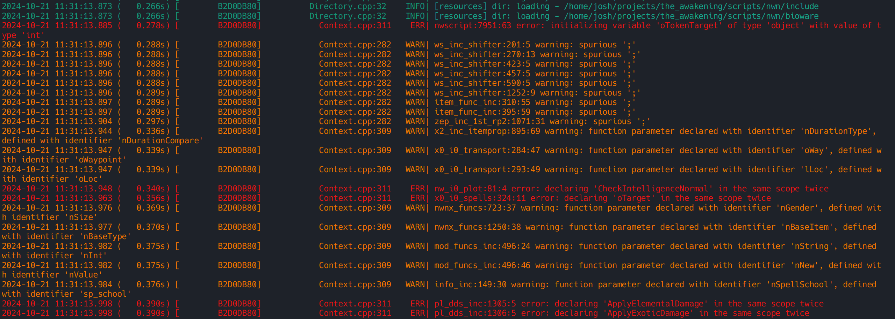

[](https://badge.fury.io/py/arclight)

# Arclight.py

These are tools related to the Arclight project

## Installation

Ideally, create and activate a Python venv.

```
pip install arclight
```

To uninstall delete the venv created above.

## 2dilate - v0.5

2dilate is a 2da merger and xlsx<->2da/x converter.  It adds a new file type, 2dx (specification below), to simplify and ease the 2da merging process.

### Goals:
* A merger that did not require using directories to separate multiple  merge files.
* A file format that is simple, compact, and familiar.  Something that could ideally be distributed with custom content to ease merging or
  shared by community members.  And also trivially implementable in any programming language/environment.
* A simple straight forward interface, that does not require a PhD to learn.

### 2dx file format version 2.1

* Header: **2DX V2.1**
* YAML Metadata: The following is optional .  The YAML metadata is enclosed within two lines containing
  "---".  If you are not familiar with YAML visit [yaml.org](http://www.yaml.org/).
  Please note that you can put _anything_ in the metadata so long as it
  conforms to the YAML specification.  Anything that 2dx doesn't understand, it ignores.
  **Note**: YAML does not like tabs, you should always uses spaces for indentation.
* Column Labels: As 2da, note however that a 2dx file needn't have all
  the columns of it's parent 2da.  Only the columns that are being
  merged need to be included.  Also, new columns can be added.
* Rows: As 2da with a couple exceptions:
  * Row numbers are significant, this is how 2dilate decides where to
    merge the 2dx file. Row numbers are not expected to start from 0, they should be start
    wherever you want to merge.  They need not be contiguous or even
    ordered.
  * Row numbers can be unspecified by '****' in which case the `row` entry in the YAML metadata is used to calculate
    new row = 2dx row number + `row`. They can also be unspecified by '####' in which case the row numbers are calculated by appending rows to the
    2da we are merging in to. I.e.: new row = base 2da last row + 2dx row number + 1.
  * **####** is a new entry type that tells 2dilate to ignore the row
    entry as far as merging goes.  This is very handy when you want to
    merge changes from a few different columns but only change some
    values on certain rows.

Reserved YAML Metadata Entries:

* `tlk` - A table of column names and integer offsets.
* `row` - Starting row for row numbers that are unspecified i.e. instead of '1', '****'.

All non-reserved YAML metadata entries are ignored. Example:

```yaml
---
description: | # Custom metadata entry.
  This renames some columns and modifies some TLK entries. It's ignored by the parser.
  Exists only for user edification

tlk:
  SomeColumn: 1000 # For all non-empty column entries the TLK entry will be calculated
  Column2: 1500    # offset + column entry + 0x01000000 (Custom TLK starting point).

row: 1000 # Any unspecified row number ('****') is replaced with 1000 + 2dx row number.

date: 2015-07-04 # Custom metadata entry.  Note that 2dilate and the 2dx reader will simply
                 # ignore this.
---
```

### Usage - `2dilate merge`

```
usage: 2dilate merge [-h] [-o OUTPUT] [--force] input files [files ...]

positional arguments:
  input                 Directory containing 2dx files to be merged.
  files                 2da file(s).

options:
  -h, --help            show this help message and exit
  -o OUTPUT, --output OUTPUT
                        Output directory.
  --force               Force merges non-default row entries.

```

### Usage - `2dilate convert`

```
usage: 2dilate convert [-h] files [files ...]

positional arguments:
  files       File(s) to convert.

options:
  -h, --help  show this help message and exit
```

## [nwscriptd](arclight/nwscriptd/README.md)

A language server for nwscript. See the [README](arclight/nwscriptd/README.md).

## nwscript-lint

A wrapper around the script parser and resolver

### Usage

```
usage: nwscript-lint [-h] [-I INCLUDE] [--no-install] [--no-user] scripts [scripts ...]

A linter for nwscript.

positional arguments:
  scripts               List of scripts to lint.

options:
  -h, --help            show this help message and exit
  -I INCLUDE, --include INCLUDE
                        Include path(s).
  --no-install          Disable loading game install files.
  --no-user             Disable user install files.
```

### Sample


